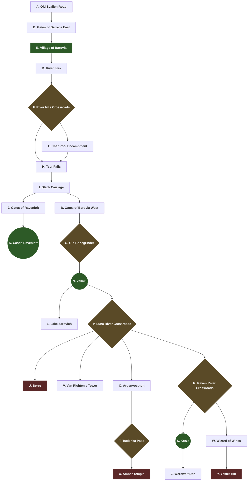

```mermaid
graph TD
    %% Node Definitions
    A[<b>A. Old Svalich Road</b>]
    B1[<b>B. Gates of Barovia East</b>]
    E[<b>E. Village of Barovia</b>]
    D[<b>D. River Ivlis</b>]
    F{<b>F. River Ivlis Crossroads</b>}
    G[<b>G. Tser Pool Encampment</b>]
    H[<b>H. Tser Falls</b>]
    I[<b>I. Black Carriage</b>]
    J[<b>J. Gates of Ravenloft</b>]
    K((<b>K. Castle Ravenloft</b>))
    B2[<b>B. Gates of Barovia West</b>]
    O{<b>O. Old Bonegrinder</b>}
    N((<b>N. Vallaki</b>))
    L[<b>L. Lake Zarovich</b>]
    P{<b>P. Luna River Crossroads</b>}
    U[<b>U. Berez</b>]
    V[<b>V. Van Richten's Tower</b>]
    Q[<b>Q. Argynvostholt</b>]
    R{<b>R. Raven River Crossroads</b>}
    W[<b>W. Wizard of Wines</b>]
    Y[<b>Y. Yester Hill</b>]
    S((<b>S. Krezk</b>))
    Z[<b>Z. Werewolf Den</b>]
    T{<b>T. Tsolenka Pass</b>}
    X[<b>X. Amber Temple</b>]

    %% Connections
    A --> B1
    B1 --> E
    E --> D
    D --> F
    F --> G
    F --> H
    G -.-> H
    H --> I
    I --> J
    I --> B2
    J --> K
    B2 --> O
    O --> N
    N --> L
    N --> P
    P --> U
    P --> V
    P --> Q
    P --> R
    R --> S
    R --> W
    W --> Y
    S --> Z
    Q --- T
    T --> X

    %% Styling
    classDef sanctuary fill:#2d5a27,stroke:#fff,color:#fff
    classDef gate fill:#5a4a27,stroke:#fff,color:#fff
    classDef boss fill:#5a2727,stroke:#fff,color:#fff

    class E,N,S,K sanctuary
    class F,O,P,R,T gate
    class X,Y,U boss
```
